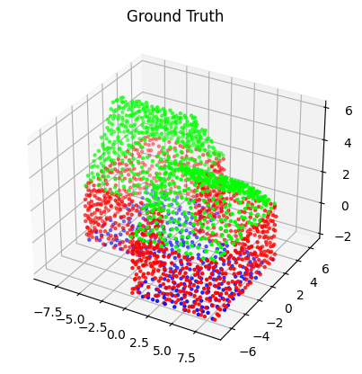

# Building 3D Point Cloud Segmentation with SimplePointNet

This project implements **3D semantic segmentation of building components** (wall, roof, floor) using a lightweight **SimplePointNet** model trained on the [Mendeley Buildings Point Cloud Dataset](https://data.mendeley.com/datasets/3thtp7mc6z/2).

---

## 📂 Dataset

We use the dataset provided on Mendeley Data:

- **Link**: [https://data.mendeley.com/datasets/3thtp7mc6z/2](https://data.mendeley.com/datasets/3thtp7mc6z/2)  
- **Format**:  
  - `.pts`: 3D point clouds (`x y z`)  
  - `.seg`: per-point labels (wall, roof, floor)

Each `.pts` file has a corresponding `.seg` file.

---

## 🏗 Model

We use a **SimplePointNet** model for segmentation:

- Input: `N × 3` point cloud (x, y, z)
- Output: `N × C` logits (C = 3 classes)
- Loss: CrossEntropy over per-point labels

```python
class SimplePointNet(nn.Module):
    def __init__(self, num_classes=3):
        super().__init__()
        self.mlp1 = nn.Sequential(
            nn.Conv1d(3, 64, 1),
            nn.BatchNorm1d(64),
            nn.ReLU()
        )
        self.mlp2 = nn.Sequential(
            nn.Conv1d(64, 128, 1),
            nn.BatchNorm1d(128),
            nn.ReLU()
        )
        self.mlp3 = nn.Sequential(
            nn.Conv1d(128, 256, 1),
            nn.BatchNorm1d(256),
            nn.ReLU()
        )
        self.fc = nn.Conv1d(256, num_classes, 1)

    def forward(self, x):
        x = x.permute(0, 2, 1)      # [B, 3, N]
        x = self.mlp1(x)
        x = self.mlp2(x)
        x = self.mlp3(x)
        x = self.fc(x)               # [B, num_classes, N]
        return x.permute(0, 2, 1)    # [B, N, num_classes]

## 📊 Results

Ground Truth vs Prediction

| Ground Truth | Prediction |
|--------------|------------|
|  |  |
